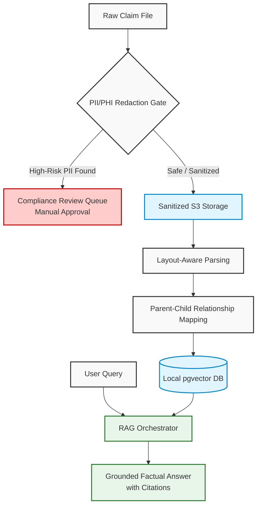

# Secure Insurance Policy Search & Data Sanitization Engine

This project is an intelligent, privacy-first search assistant designed for insurance claims adjusters and underwriters.

It solves a major industry challenge: **how to use Artificial Intelligence (AI) to search complex policy documents without exposing sensitive customer data (PII/PHI) to public cloud providers, keeping the entire process 100% secure and HIPAA-compliant.**

---

## The Problem This Solves

1. **The Compliance Risk**: Insurance claim files contain highly sensitive personal information (Names, Social Security Numbers, Medical Records). Sending these raw files to public cloud-based AI services violates HIPAA, state laws, and internal privacy policies.
2. **The "Broken Context" Problem**: Standard AI systems split long documents into arbitrary, random chunks. In insurance, this often separates a main policy clause from its critical disclaimer located elsewhere in the document, causing the AI to hallucinate or misinform adjusters.

---

## How This Project Works

This system is divided into three local, secure pipelines:

### 1. The Sanitization Gate (PII/PHI Redaction)

Before any claims document enters the system, it passes through an automated redaction filter.

* **Smart Detection**: It instantly identifies and masks elements like names, phone numbers, and addresses.
* **Human-in-the-Loop Safeguard**: If a document contains high-risk data (such as a valid Social Security Number), the system automatically locks the file and routes it to a secure database queue (`compliance_queue`) for manual review by a compliance officer before it is allowed into the search index.

### 2. Layout-Aware Policy Indexing

Instead of breaking documents apart blindly, this pipeline reads structural formatting (like headers, bullet points, and tables).

* **Parent-Child Mapping**: It stores policies in a hierarchical structure. High-level coverage clauses are marked as "Parents," and their granular exclusions/disclaimers are mapped as "Children".
* **Explicit Linking**: The system programmatically locks disclaimers and clauses together in the database, ensuring that if an adjuster retrieves a clause, the system automatically flags its conditional exclusions.

### 3. Factual, Local AI Searching

Adjusters query the system using natural language (e.g., *"Is windstorm damage covered under this policy?"*).

* **Precise Retrieval**: The system filters results by State, Policy Year, and Policy Type before searching, preventing a 2021 Texas guideline from overriding a 2024 New York claim.
* **Grounded Answers with Citations**: A local language model (LLM) reads the matching text, drafts a summary, and adds strict bracket citations (e.g., `[1]`, `[2]`) pointing back to the exact source paragraphs.

---

## Operational Flow



---

## Glossary of Terms

* **RAG (Retrieval-Augmented Generation)**: An AI framework that retrieves real, verified facts from an external database to ground a language model's responses, eliminating the risk of AI "hallucinations" or imaginary answers.
* **PII & PHI (Personally Identifiable Information / Protected Health Information)**: Any sensitive personal data (e.g., names, SSNs, phone numbers) or medical data protected under global compliance frameworks such as HIPAA.
* **pgvector**: An open-source vector similarity search extension for PostgreSQL. It allows us to save and query high-dimensional AI vectors directly inside our standard relational database.
* **Ollama**: A lightweight local framework that runs large language and embedding models natively with hardware acceleration on your MacBook Air.
* **Parent-Child Chunking**: An indexing method where high-level clauses ("Parents") are logically grouped with their associated disclaimers and sub-exceptions ("Children"), preventing critical context from being severed during text splitting.
* **HITL (Human-in-the-Loop)**: A compliance workflow design where automated filters flag high-risk or ambiguous files for manual verification by a human operator before they are permitted to proceed.

---

## Why This Architecture is Unique

* **100% Local & Offline**: All processing, redaction, vector generation, and AI conversations run locally on your own computer. Zero data is sent to the internet.
* **Apple Silicon Hardware Accelerated**: The embedding and language models are optimized to run directly on your Mac's M-series GPU for maximum execution speed.
* **No Subscription or API Fees**: By utilizing local open-source models (Ollama, Presidio), you can run thousands of queries for free with no cloud usage costs.

---

## Quick Start Guide

### Prerequisites

Before running, make sure your Mac has Docker Desktop and Ollama installed.

### Step 1: Start the Infrastructure Stack

Spin up the local PostgreSQL database, local S3 storage, and the local PII redaction engine:

```bash
cd insurance-rag/infrastructure
docker compose up -d
```

### Step 2: Set Up Local Storage Buckets

Create your local, private S3 folders to hold claim files:

```bash
export AWS_ACCESS_KEY_ID="mock"
export AWS_SECRET_ACCESS_KEY="mock"
export AWS_DEFAULT_REGION="us-east-1"

aws --endpoint-url=http://localhost:4566 s3 mb s3://raw-claims
aws --endpoint-url=http://localhost:4566 s3 mb s3://sanitized-claims
```

### Step 3: Run the AI Models Locally

Pull down your local embedding and language models:

```bash
ollama run nomic-embed-text
ollama run llama3
```

### Step 4: Run the Backend Application

Navigate to your backend directory and boot up the Spring Boot server:

```bash
cd ../backend
mvn clean compile -s local-settings.xml
mvn org.springframework.boot:spring-boot-maven-plugin:3.3.0:run -s local-settings.xml
```

---

## Branching & Commit Conventions

To maintain a clean codebase, we enforce standard conventions:

* **Branch names**: `feature/<ticket>-description` or `bugfix/<ticket>-description`
* **Commit prefixes**:
  * `feat: ...` (New features/API endpoints)
  * `fix: ...` (Bug fixes or database schema changes)
  * `docs: ...` (Documentation changes)
  * `chore: ...` (Build files or dependency updates)