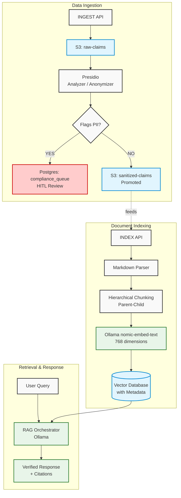

# Secure Insurance RAG & Data Sanitization Pipeline

## System Context
This service orchestrates secure, layout-aware policy document ingestion and semantic search (RAG). It serves as the middleware connecting claim case files, local storage (S3), privacy filters (Presidio), and vectorized policy structures (pgvector) to assist claims adjusters with zero cloud data leakage risk.

## Build, Test & Run Commands
Ensure your Docker Desktop environment and local Ollama are running natively.

    # 1. Spin up Infrastructure (PostgreSQL, Presidio, S3 LocalStack)
    cd insurance-rag-infra
    docker compose up -d

    # 2. Setup Local S3 Buckets (Requires mock AWS profile)
    aws --endpoint-url=http://localhost:4566 s3 mb s3://raw-claims
    aws --endpoint-url=http://localhost:4566 s3 mb s3://sanitized-claims

    # 3. Pull Local AI Models
    ollama run nomic-embed-text
    ollama run llama3

    # 4. Build & Compile Backend
    cd ../insurance-rag-backend
    mvn clean compile -s local-settings.xml

    # 5. Boot Spring Application (Bypassing Corporate Proxies)
    mvn org.springframework.boot:spring-boot-maven-plugin:3.3.0:run -s local-settings.xml

## Request Flow

## Detailed Component Architecture

### 1. Data Ingestion & Governance Pipeline (PII/PHI Redaction)
Before any historical claim case files are processed for querying, they must undergo strict data sanitization to comply with HIPAA, state laws, and internal privacy policies.
* **Automated PII/PHI Detection & Redaction**: The pipeline automatically identifies and masks elements such as patient names, Social Security Numbers, addresses, policy numbers, and specific medical histories using Microsoft Presidio.
* **Human-in-the-Loop (HITL) Audit**: Because automated redaction is rarely 100% accurate, high-risk documents or sample batches should route to a compliance queue (`compliance_queue` table) for manual verification prior to final indexing.

### 2. Document Parsing & Semantic Indexing Pipeline (Layout-Aware RAG)
Traditional text splitters often break documents into arbitrary character limits, which can sever the connection between a main policy clause and a disclaimer located elsewhere on the page or in the appendix.
* **Layout-Aware Document Parsing**: Instead of plain text extraction, use a layout-aware PDF parser that can recognize structural elements like tables, headers, footers, and marginalia.
* **Hierarchical Chunking & Cross-Referencing**: Store policy documents in a hierarchical structure. A "Parent" chunk represents the overall clause, while "Child" chunks capture the granular details, including associated disclaimers.
* **Explicit Relationship Mapping**: Metadata tags are explicitly linked to support semantic indexing.

### 3. Retrieval & Query Interface (RAG Orchestrator)
The interface used by claim adjusters and underwriters must return highly reliable, context-aware answers with clear citations.
* **Vector and Hybrid Search**: Utilize a vector database (e.g., pgvector) supporting dense vector embeddings for semantic meaning.
* **Metadata Filtering**: Allows filtering queries by state, policy year, and coverage type before the search is executed to prevent cross-jurisdiction guidance overlap.
* **Large Language Model (LLM) Integration with Guardrails**: Instructs the local Llama3 model to draft responses strictly using the provided context, clearly separating "Coverage Details" from "Applicable Disclaimers/Limitations" with strict annotations.

## Key Design Decisions
* **100% On-Premise Execution**: Eliminates HIPAA compliance liabilities by utilizing local containers (Presidio/LocalStack) and local Apple Silicon hardware-accelerated LLMs (Ollama).
* **768-Dimension Local Vectors**: Uses `nomic-embed-text` rather than OpenAI `1536` models to ensure lightweight, fast local execution on client work machines.
* **Parent-Child Cross-Referencing**: Avoids broken context in policies. Disclaimers are mapped to their parent clauses explicitly via the database array `related_chunk_ids`.
* **Project-Level Maven Bypass**: Uses `local-settings.xml` to allow secure open-source downloading without triggering corporate Artifactory `403` proxy blocks.

## Development Conventions
* **NLP/Redaction Rules**: Modify or append custom regex/NER patterns in `RedactionService.java`.
* **Model Configurations**: Switch embedding/chat configurations in `AIConfig.java`.
* **Database Updates**: Keep database schemas updated inside `src/main/resources/schema.sql` and mirror changes in the PostgreSQL creation scripts.

## Branching & Commit Formats
* **Branching Strategy**: `feature/<ticket-id>-description`, `bugfix/<ticket-id>-description`
* **Commit Conventions**: Conventional Commits strictly enforced:
  * `feat: add local Ollama integration`
  * `fix: correct vector dimension type mismatch`
  * `docs: add technical architecture layout`